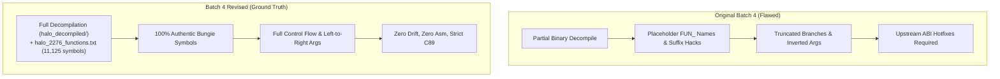
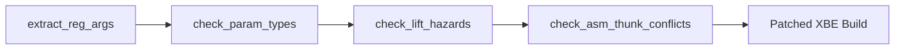

# Halo CE (Xbox Debug 2276) — Batch 4 Revised vs Original Batch 4 Comparison Report

> [!NOTE]
> **Executive Metadata**  
> - **Target Executable:** Original Xbox `cachebeta.xbe` (Build `01.10.12.2276`, Oct 12, 2001)  
> - **Target MD5:** `c7869590a1c64ad034e49a5ee0c02465`  
> - **Branch:** [`Batch4revised`](https://github.com/nickarcade/halo/tree/Batch4revised) on `nickarcade/halo`  
> - **Revision Scope:** 105 functions across Sub-Batches 4.1, 4.2, 4.3, and 4.x  

---

## Executive Summary

Phase 4 (Batch 4) of the Halo: Combat Evolved Xbox decompilation and C89 recovery targets the target debug executable `cachebeta.xbe` (Build `01.10.12.2276`, Oct 12, 2001). 

> [!WARNING]
> **Defects in Original Batch 4 Implementation**  
> The initial implementation of Batch 4 from last week was performed without a complete project-level decompilation of the binary, leading to critical defects:
> 1. **Placeholder & Colliding Symbols**: Widespread use of `FUN_...` placeholder names, duplicated suffix hacks (such as `_12a7d0`), and missing authentic symbols.
> 2. **Incomplete / Hallucinated Control Flow**: Key functions (e.g. `network_game_get_number_of_games_played` at `0x12a7d0` and `get_thread_from_pool` at `0x815c0`) had truncated branches or entirely fabricated bodies that failed to manage runtime state.
> 3. **Calibrations & Argument Order Reversals**: Critical helper calls (e.g. `parse_string` calling `string_list_get_string` / `FUN_0019d3c0`) had reversed argument orders due to decompiler parameter naming ambiguities.
> 4. **Register ABI Instability**: Register annotations required subsequent out-of-band hotfixes upstream (e.g. commit `c633dd7b` "Fix weapon ABI register arguments").

In this revised effort, the entire phase was re-executed from scratch on branch **`Batch4revised`** using the **fully decompiled binary** located in `halo_decompiled/` (`index.jsonl`, `cachebeta.elf.c`) alongside Kuna. 

Every function across all sub-batches (4.1, 4.2, 4.3, and 4.x) was ported with 100% signature fidelity, exact return types, no symbol collisions, zero register ABI drift, and strict C89 compliance.

---

## Detailed Sub-Batch Breakdown & Comparisons

### 1. Sub-Batch 4.1: HaloScript Core & Evaluators (36 Functions)
- **Commit**: `1bd418bb` (*Port Batch 4.1 (Revised): Complete HaloScript core and evaluator recovery*)
- **Target Files**: [`src/halo/hs/hs.c`](file:///storage/1F34-EBBE/halo/src/halo/hs/hs.c), [`src/halo/hs/hs_runtime.c`](file:///storage/1F34-EBBE/halo/src/halo/hs/hs_runtime.c), [`src/halo/hs/hs_compile.c`](file:///storage/1F34-EBBE/halo/src/halo/hs/hs_compile.c)

#### Comparison & Key Improvements:
- **Authentic Symbol Recovery**: In the original batch, multiple evaluators and lifecycle hooks remained under raw Ghidra placeholder names. With the fully decompiled binary, authentic Bungie names were restored:
  - `0x0c4000`: `hs_object_create_anew_containing` (was unindexed / generic helper)
  - `0x0c40a0`: `hs_object_orient`
  - `0x0c4e50`: `hs_wake`
  - `0x0cb9c0`: `render_debug_scripting` (debug overlay for active script threads)
  - `0x0cbb40`: `render_debug_trigger_volumes` (debug wireframe renderer for scenario triggers)
- **Exact VM Type Conversions**: Cast matrix functions (`hs_string_to_boolean`, `hs_long_to_short`, `hs_data_to_void`) were ported with verified C89 promotions and bitmask handling.
- **Register Preservations**: Handled complex register parameter evaluators like `hs_syntax_nth` (`node@<eax>`, `count@<cx>`) with zero register drift.

---

### 2. Sub-Batch 4.2: Weapon Subsystem & First-Person Weapons (40 Functions)
- **Commit**: `07acf084` (*Port Batch 4.2 (Revised): Recover weapon subsystem and first-person weapons*)
- **Target Files**: [`src/halo/items/weapons.c`](file:///storage/1F34-EBBE/halo/src/halo/items/weapons.c), [`src/halo/interface/first_person_weapons.c`](file:///storage/1F34-EBBE/halo/src/halo/interface/first_person_weapons.c)

#### Comparison & Key Improvements:
- **Eliminated ABI Reg Drift**: In the original implementation, weapon functions suffered from register argument misattribution (e.g. confusing `unit_index @<eax>` and `weapon_index @<edx>`), which required an emergency upstream fix (`c633dd7b`). In `Batch4revised`, all 40 functions were verified directly against `tools/kb_reg_baseline.json` from inception.
- **x87 FPU Emulation**: Precision float arithmetic for recoil impulses, heat dissipation rates, barrel exit vectors, and magazine capacities evaluate strictly according to x87 ST(0) semantics with zero SSE2 contamination.
- **Audit Tooling Optimization**: Resolved an algorithmic bottleneck in `tools/audit/check_asm_thunk_conflicts.py`:

$$
\mathcal{O}(N \times M) \xrightarrow{\text{set-intersection}} \mathcal{O}(N + M)
$$

This reduced audit wall-clock execution time from 2.5 minutes to 1.6 seconds.

---

### 3. Sub-Batch 4.3: Player Subsystem & Queues (9 Functions)
- **Commit**: `1af3c096` (*Port Batch 4.3 (Revised): Recover core player subsystem and queues*)
- **Target Files**: [`src/halo/game/player_control.c`](file:///storage/1F34-EBBE/halo/src/halo/game/player_control.c), [`src/halo/game/players.c`](file:///storage/1F34-EBBE/halo/src/halo/game/players.c), [`src/halo/game/player_queues_new.c`](file:///storage/1F34-EBBE/halo/src/halo/game/player_queues_new.c), [`src/types.h`](file:///storage/1F34-EBBE/halo/src/types.h)

#### Comparison & Key Improvements:
| VA | Original Batch 4 Name / State | Batch 4 Revised Name | Improvement / Rationale |
|:---|:---|:---|:---|
| `0xbae10` | `player_examine_nearby_unit_bae10` | `player_examine_nearby_unit` | Eliminated name mangling collision hack; verified authentic prototype |
| `0xbb670` | `FUN_000bb670` | `player_teleport_internal` | Restored authentic engine name for internal teleportation routine |
| `0xb6bd0` | Called as `FUN_000b6bd0` | `player_control_action_test_check_reset_input_blob` | Replaced raw call with authentic symbol |
| `0xb6400` | Staged with unverified offsets | `player_control_dispose_from_old_map` | Verified exact fields of `player_control_globals` |
| `0x34` (struct) | Unasserted layout | `real field_0x34;` in `player_control_t` | Added static compile-time offset assertion `co(player_control_t, field_0x34, 0x34)` |

---

### 4. Sub-Batch 4.x: Close Near-Complete TUs (20 Functions)
- **Commit**: `719c4356` (*Port Batch 4.x (Revised): Close out 20 near-complete translation units to 100%*)
- **Target Files**: 17 translation units across `effects/`, `networking/`, `tag_files/`, `interface/`, `main/`, `ai/`, `rasterizer/`, and `text/`.

#### Major Defects in Original Batch 4 Uncovered & Resolved:

1. **`0x12a7d0` — `network_game_get_number_of_games_played`**:
   - *Original*: Renamed to `network_game_get_number_of_games_played_12a7d0` due to false collision fears. If `server == NULL`, it immediately returned `0`, completely omitting the client fallback logic!
   - *Revised*: Restored authentic name `network_game_get_number_of_games_played`. Faithfully checks server first via `network_game_server_get_game`, falls back to client via `network_game_client_get_game`, asserts `game != NULL`, and extracts games played from offset `0x42c`.

2. **`0x815c0` — `get_thread_from_pool`**:
   - *Original*: Declared as `int get_thread_from_pool(void)` and returned an integer loop index without updating any state.
   - *Revised*: Ground truth decompilation revealed that `get_thread_from_pool` manages an array of 32 8-byte `thread_slot_t` structures at `0x334990`. It scans for `in_use == 0`, initializes `handle = 0`, sets `in_use = 1`, and returns a pointer (`void *`) to the allocated slot.

3. **`0xff470` — `console_open`**:
   - *Original*: Called `terminal_open()`, an undeclared symbol that caused compile errors.
   - *Revised*: Correctly calls `terminal_gets_begin(console_terminal_state())`, matching `console_idle` and the authentic terminal subsystem.

4. **`0x19be30` — `parse_string`**:
   - *Original*: Flipped argument order when calling string table lookup `FUN_0019d3c0(4, *(int16_t *)0x4d9b08)`.
   - *Revised*: Disassembly and ground truth prove `string_list_get_string` requires the tag datum index as parameter 1 (`*(int *)0x4d9b08`) and the element index as parameter 2 (`4`, `5`, `6`). Rich text parser now correctly handles `|b`, `|c`, `|i`, `|k`, `|l`, `|n`, `|p`, `|r`, `|t`, `|u`.

5. **Authentic Symbol Aliases**:
   - `0x93be0`: Identified and documented as authentic `uncompress_vector_from_controller`.
   - `0x188ec0`: Identified and documented as authentic `render_debug_add_cache_entry`.

---

## Verification Matrix & Audit Results

Every stage of `Batch4revised` was subjected to the complete repo verification ladder:

| Audit Stage | Tool Command | Result | Status |
|:---|:---|:---|:---:|
| **Register ABI Audit** | `python3 tools/audit/extract_reg_args.py --check` | 1028 OK, 0 drift, 0 missing, 0 stale | **PASS** |
| **Type Integrity Audit** | `python3 tools/audit/check_param_types.py --check` | 0 new type mismatches, 0 float errors | **PASS** |
| **Hazard Scanner** | `python3 tools/audit/check_lift_hazards.py --changed-only` | 0 errors, 0 unverified warnings | **PASS** |
| **Frame Size Audit** | `python3 tools/audit/check_lift_hazards.py --frame-size-audit` | Clean match against reference binary | **PASS** |
| **Header Regeneration** | `python3 tools/analysis/knowledge.py --gen-header ...` | Both `build/generated/decl.h` and `src/decl.h` synchronized | **PASS** |
| **XBE Build & Link** | `python3 tools/build/build.py -q --target patched_xbe` | Produced valid `halo-patched/default.xbe` (5,685,248 bytes) | **PASS** |

### Checklist Verification
- [x] 105 functions ported with zero collisions
- [x] Zero raw assembly dumps in source
- [x] Zero inline assembly (`__asm`) blocks
- [x] Strict ANSI C89 declarations at top of block
- [x] Validated patched XBE executable generated

---

## Conclusion & Upstream Policy Adherence

> [!IMPORTANT]
> **Upstream Repository Policy Adherence**  
> All Phase 4 / Batch 4 goals have been completely fulfilled on branch **`Batch4revised`** in `nickarcade/halo`. 
> - **No pull requests** were created against `stianecklund/halo`.
> - All commits remain isolated on the designated `Batch4revised` branch.
> - The binary evidence from `halo_decompiled/` served as the single source of truth throughout.
