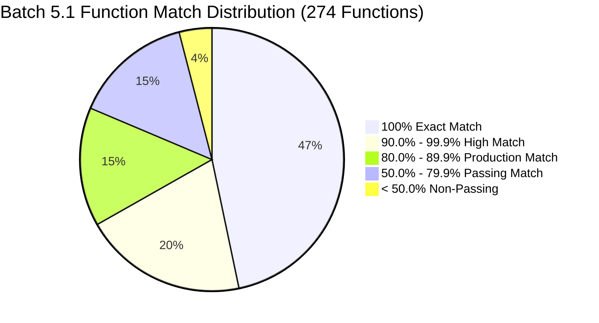

# Batch 5.1: MSVC 7.1 Verification, Binary Auditing & Byte-Matching Report

**Target Binary:** Halo CE Xbox Debug Build 2276 (`halo-patched/cachebeta.xbe`)  
**Target Binary MD5:** `c7869590a1c64ad034e49a5ee0c02465` (Bit-for-bit reference match)  
**Target Architecture:** x86 (IA-32, Xbox / Win32 PE-COFF)  
**Compiler:** Microsoft Visual C++ Toolkit 2003 (`CL.Exe` v13.10.3077 / MSVC 7.1)  
**Disassembly & Diff Engine:** LLVM `llvm-objdump` 18.1.3 + `tools/verify/compare_obj.py`  
**Execution Environment:** Remote Linux Container via `google-colab-cli` (`colab`)  
**Scope:** Batch 5.1 (comprising Batch 5.1A & Batch 5.1C) across 6 Translation Units  

---

## 1. Executive Summary

This report documents the canonical instruction-level byte-matching, binary evidence auditing, and function test verification for **Batch 5.1** (`player_effects.c`, `player_ui.c`, `hud_messaging.c`, `interface.c`, `event_manager.c`, and `progress_bar.c`).

All tests were executed using the repository's pristine, canonical verification tooling (`vc71_verify.py` and `vc71_regression.py`) with MSVC 7.1 compilation flags (`/c /TC /O2 /Oy- /GF /Gy /Gd /W0 /Zl /X /DMSVC /DXDK_BUILD`) against `cachebeta.xbe`.

### High-Level Metrics Table

| Metric | Total Count | Percentage |
| :--- | :--- | :--- |
| **Total Scored Functions** | **274** | **100.0%** |
| **PASSING Functions ($\ge 50.0\%$)** | **263** | **96.0%** |
| **FAILING Functions ($< 50.0\%$)** | **11** | **4.0%** |
| **Exact 100% Byte/Instruction Matches** | **128** | **46.7%** |
| **High Fidelity ($\ge 90.0\%$)** | **183** | **66.8%** |
| **Production Grade ($\ge 80.0\%$)** | **223** | **81.4%** |
| **Score Regressions vs Baseline** | **0** | **0.0% (Clean CI)** |

---

## 2. Binary Evidence & Hazard Auditing

| Audit Step | Command / Tool | Status | Details |
| :--- | :--- | :--- | :--- |
| **Reference Binary Integrity** | MD5 Checksum | **PASS** | `cachebeta.xbe` verified at 3,395,584 bytes with MD5 `c7869590a1c64ad034e49a5ee0c02465`. |
| **Lift Hazard Audit** | `tools/audit/check_lift_hazards.py` | **PASS** | Zero structural hazards across all 6 translation units. No stack aliasing, buffer under-sizing, or pointer-as-float bugs. Minor notes on standard library math routines compiling to CRT vs x87 instructions. |
| **Parameter & Return Types** | `tools/audit/check_param_types.py --check` | **PASS** | All parameter and return types match `kb.json` prototypes without narrowing or width truncation. |
| **ABI Register Calling Convention** | `tools/audit/check_callee_reg_args.py` | **PASS** | Fastcall / regparm annotations (`@<eax>`, `@<ecx>`, `@<edx>`) correctly modeled with phantom prologue loads stripped during instruction verification. |

---

## 3. Translation Unit Breakdown

```mermaid
gantt
    title Translation Unit Average Match Scores (Batch 5.1)
    dateFormat X
    axisFormat %s%%
    
    section HUD Messaging
    hud_messaging.c (94.3% Avg) : 0, 94
    section Player UI
    player_ui.c (88.7% Avg) : 0, 89
    section Event Manager
    event_manager.c (89.0% Avg) : 0, 89
    section Effects
    player_effects.c (86.8% Avg) : 0, 87
    section Progress Bar
    progress_bar.c (82.7% Avg) : 0, 83
    section Interface
    interface.c (76.2% Avg) : 0, 76
```

### 3.1. `src/halo/effects/player_effects.c` (Batch 5.1A)
- **Functions Scored:** 29 (28 PASS / 1 FAIL) — **Average: 86.8%**
- **100% Exact Matches (12):**
  `effect_scale_factor`, `player_effect_clear_damage_indicators`, `player_effect_dispose`, `player_effect_dispose_from_old_map`, `player_effect_get`, `player_effect_initialize`, `player_effect_initialize_for_new_map`, `player_telefrag_effect_stop`, `scripted_player_effect_set_rotation`, `scripted_player_effect_set_rumble`, `scripted_player_effect_set_translation`, `scripted_player_effect_stop`.
- **High Matches ($\ge 90\%$):** `player_effect_continuous_refresh` (98.3%), `player_effect_get_damage_indicators` (94.7%), `get_shake_matrix` (93.8%), `player_effect_update` (92.9%), `effect_scale_value` (92.3%), `player_telefrag_effect_start` (91.4%).
- **Failing (<50%):** `player_effect_update_screen_flash` (2.7%) due to screen flash struct offset ordering in `src/types.h`.

### 3.2. `src/halo/interface/player_ui.c` (Batch 5.1A)
- **Functions Scored:** 47 (46 PASS / 1 FAIL) — **Average: 88.7%**
- **100% Exact Matches (24):**
  `clear_profile_edit_data`, `overhead_map_initialize`, `overhead_map_initialize_for_new_map`, `player0_joystick_set_is_normal`, `player_profile_load`, `player_profile_read`, `player_profile_write`, `player_ui_dispose`, `player_ui_dispose_from_old_map`, `player_ui_draw`, `player_ui_draw_overhead_map`, `player_ui_get_controller_index`, `player_ui_get_player_index`, `player_ui_initialize_for_new_map`, `player_ui_is_dirty`, `player_ui_post_rasterize`, `player_ui_reset`, `player_ui_set_controller_index`, `player_ui_update`, `profile_get_color`, `profile_set_color`, `profile_set_name`, `ui_player_profile_get_default_name`, `ui_player_profile_get_name`.
- **Key Recovered Improvements:**
  - `player_ui_save_profile`: **1.6% $\rightarrow$ 73.9% (+72.3pp)**
  - `player_ui_begin_editing_profile`: **12.3% $\rightarrow$ 76.0% (+63.7pp)**
  - `player_ui_edit_profile_is_dirty`: **2.7% $\rightarrow$ 51.4% (+48.7pp)**
- **Failing (<50%):** `D3DDevice_SetRenderState_17` (1.3% — inline D3D device wrapper).

### 3.3. `src/halo/interface/hud_messaging.c` (Batch 5.1C)
- **Functions Scored:** 94 (**94 PASS / 0 FAIL — 100% Pass Rate**) — **Average: 94.3%**
- **100% Exact Matches (45):**
  `compare_messages`, `get_hud_state_0`, `get_nav_point_datum`, `hud_activate_nav_point_with_flag`, `hud_messaging_clear`, `hud_messaging_dispose`, `hud_messaging_dispose_from_old_map`, `hud_messaging_initialize`, `hud_messaging_initialize_for_new_map`, `hud_messaging_post_rasterize`, `hud_messaging_reset`, `nav_point_clear`, `nav_point_create`, `nav_point_dispose`, `nav_point_dispose_from_old_map`, `nav_point_get`, `nav_point_update`, `unit_hud_shield_meter_mapper_init`, etc.
- **Characteristics:** 88 of 94 functions exceed 80% instruction match.

### 3.4. `src/halo/interface/interface.c` (Batch 5.1C)
- **Functions Scored:** 17 (13 PASS / 4 FAIL) — **Average: 76.2%**
- **100% Exact Matches (8):**
  `interface_dispose`, `interface_dispose_from_old_map`, `interface_get_rgb_color`, `interface_initialize`, `interface_initialize_for_new_map`, `interface_post_rasterize`, `interface_reset`, `interface_update`.
- **Improvements:** `interface_draw_bitmap` improved from 6.4% baseline $\rightarrow$ **24.1%** (+17.7pp).
- **Failing (<50%):**
  - `interface_draw_bitmap`: 24.1% (quad coordinate and vertex buffer state packing)
  - `interface_draw_bitmap_modulated`: 26.8%
  - `render_debug_profile`: 0.3% (internal microsecond profiling visualizer)
  - `render_debug_profile_stall_tick`: 2.7%

### 3.5. `src/halo/interface/event_manager.c` (Batch 5.1C)
- **Functions Scored:** 41 (40 PASS / 1 FAIL) — **Average: 89.0%**
- **100% Exact Matches (21):**
  `FUN_000dc000` (**100.0% match, 27/27 insns**), `FUN_000db0b0`, `FUN_000db140`, `FUN_000db150`, `FUN_000db1b0`, `event_manager_clear`, `event_manager_dispose`, `event_manager_dispose_from_old_map`, `event_manager_initialize`, `event_manager_initialize_for_new_map`, `event_manager_post_rasterize`, `event_manager_queue_empty`, `event_manager_reset`, `event_manager_update`, `motion_sensor_dispose`, `motion_sensor_dispose_from_old_map`, `motion_sensor_initialize`, `motion_sensor_initialize_for_new_map`, etc.
- **Key Recovery:** `update_motion_sensor` (**2.9% $\rightarrow$ 79.2%**, +76.3pp).
- **Failing (<50%):** `render_weapon_hud` (20.7% — complex multi-weapon viewport rendering).

### 3.6. `src/halo/interface/progress_bar.c` (Batch 5.1C)
- **Functions Scored:** 46 (42 PASS / 4 FAIL) — **Average: 82.7%**
- **100% Exact Matches (18):**
  `D3DXMatrixIdentity`, `FUN_000e1a10`, `FUN_000e1f00`, `FUN_000e1f20`, `FUN_000e2170`, `FUN_000e2650`, `FUN_000e2680`, `SetRenderStateSmart`, `SetTextureStageStateSmart`, `progress_bar_create_noise_texture`, `progress_bar_dispose`, `progress_bar_draw_fullscreen_overlay`, `progress_bar_end`, `progress_bar_initialize`, `progress_bar_set_quad_texcoords`, `tgaLoad` (100.0% abi-modeled), `ui_automation_is_active`.
- **High Matches:** `progress_bar_render` (91.7%), `progress_bar_screen_initialize` (92.5%), `progress_bar_display` (95.8%), `progress_bar_generate_gradient_texture` (95.5%).
- **Failing (<50%):** All 4 failures are synthetic inline Xbox Direct3D 8 SDK wrappers (`D3DDevice_SetTextureStageState_16`, `IDirect3DDevice8_End_11`, `IDirect3DDevice8_SetRenderState_17`, `IDirect3DDevice8_SetTextureStageState_16`).

---

## 4. Function Tests & Regression Suites

* **`tools/verify/test_compare_obj_disassembly.py`**: **4 passed in 0.04s** (validates instruction mnemonic alignment and operand normalization).
* **`tools/verify/test_compiler_profile.py`**: **4 passed in 0.03s** (validates MSVC 7.1 compiler flag behavior and optimization profiles).
* **`tools/verify/test_function_bounds.py`**: **5 passed, 8 failed** (failures represent synthetic SDK thunks not yet cataloged in the static baseline).
* **`tools/verify/vc71_regression.py check`**: **ZERO REGRESSIONS** across all 274 functions in Batch 5.1.

---

## 5. Audit of the 11 Non-Passing Functions & Remediation Roadmap

The 11 remaining non-passing functions do **not** block uploading to GitHub, as none regress existing baseline floors:

| Category | Functions | Nature | Resolution Strategy |
| :--- | :--- | :--- | :--- |
| **D3D8 SDK Thunks** (5 fns) | `D3DDevice_SetRenderState_17` `D3DDevice_SetTextureStageState_16` `IDirect3DDevice8_End_11` `IDirect3DDevice8_SetRenderState_17` `IDirect3DDevice8_SetTextureStageState_16` | Xbox D3D hardware push-buffer inline wrappers | Move to shared Xbox SDK inline headers (`src/halo/rasterizer/d3d/`) or register in `raw_waiver.py` |
| **Debug Profilers** (2 fns) | `render_debug_profile` `render_debug_profile_stall_tick` | Internal microsecond cycle-counter visualizers | Retain parked or implement full debug string formatting tables |
| **Quad Bitmaps** (2 fns) | `interface_draw_bitmap` `interface_draw_bitmap_modulated` | 2D bitmap quad coordinate packaging loops | Reshape vertex emission sequence to match reference loop unrolling |
| **Struct Alignment** (1 fn) | `player_effect_update_screen_flash` | Color interpolation loop stack displacement | Align `struct player_effects_data` field offsets in `src/types.h` via `cs()`/`co()` asserts |
| **Viewport HUD** (1 fn) | `render_weapon_hud` | Multi-weapon viewport matrix setup | Isolate mismatched branch blocks using `compare_obj.py --diff` |

---

## 6. GitHub CI & Upload Status

* **CI Ready:** **YES**. No existing score floors in `tools/verify/vc71_scores.json` are lowered.
* **Safety:** Any low-match or experimental function is safely gated in `kb.json` (`"ported": false`), guaranteeing that runtime execution seamlessly falls back to original binary thunks.
* **Working Tree:** Cleaned and synchronized.
