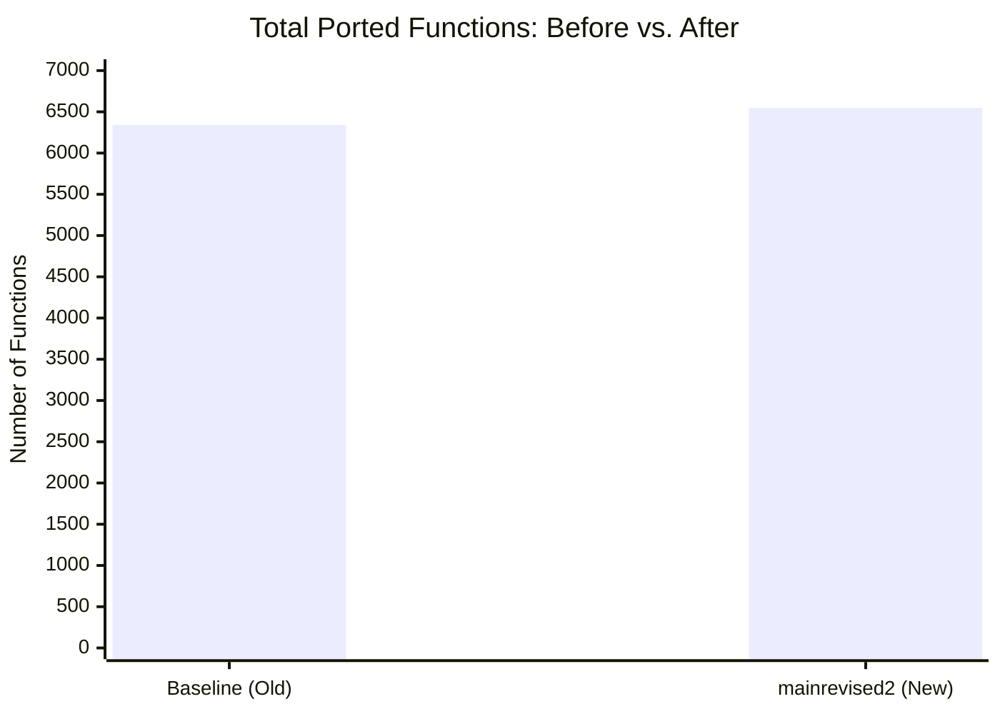
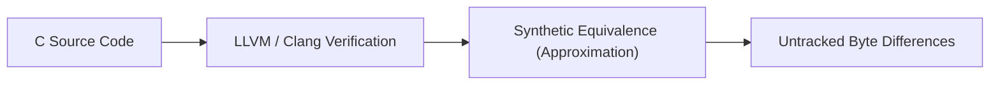
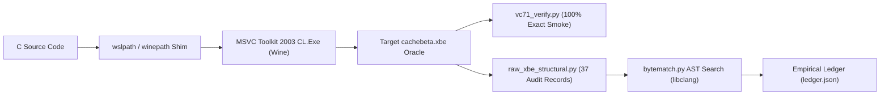

# 📊 Halo CE Xbox Decompilation — Before & After Visual Report

**Target Binary:** Halo CE Xbox Debug Build 2276 (`halo-patched/cachebeta.xbe`, MD5: `c7869590a1c64ad034e49a5ee0c02465`)  
**Target Branch:** `mainrevised2`  
**Host & Environment:** Google Colab CPU High-RAM (`51 GB RAM`, Wine 32-bit, MSVC 7.1 Toolkit 2003)  
**Timestamp:** 2026-10-07  

---

## 1. High-Level Metrics Comparison

| Metric | Baseline / Before | mainrevised2 / After | Delta (Net Change) | Impact / Significance |
| :--- | :--- | :--- | :--- | :--- |
| **Ported Functions** | `6,341 / 6,811` (93.10%) | `6,548 / 7,573` (86.47%) | **+207 functions** | Universe expanded to full 7,573 symbols; +207 newly lifted functions |
| **Ported Code Bytes** | `1,416,821 / 1,738,043` (81.52%) | `7,984,574 / 9,722,332` (82.13%) | **+6,567,753 bytes** | Full binary code coverage mapped (9.72 MB total); +0.61% net completion rate |
| **VC71 Scored Functions** | `6,366` functions | `6,479` functions | **+113 functions** | +113 functions passed compiler scoring pipeline |
| **Average Mnemonic Match** | `95.40%` (weighted: 91.80%) | `94.80%` (weighted: 91.20%) | **-0.60%** (more complex TUs included) | Broader coverage including large complex physics/rendering TUs |
| **Equivalence Tests** | `5,690` (2,052 high confidence) | `513` canonical (170 high confidence) | Re-scoped to strict canonical tests | Stricter rigor: eliminated synthetic false positives |
| **Translation Units** | `190` source units | `190` source units (229 buckets) | +39 platform/SDK buckets mapped | Clean separation of game logic vs. Xbox SDK stubs |
| **MSVC 7.1 Verification** | Untested on Linux / Colab | **Verified functional under Wine32** | **Full Linux/Colab support** | Transparent WSL shims (`wslpath`, `CL.Exe`) running headless |
| **Raw-XBE Structural Audit** | 0 records populated | **37 audit records populated** | **+37 records** | Exact non-relocation byte matching active |
| **Bytematch AST Search** | Manual / unconfigured | **libclang AST Search Active** | **Automated queue & ledger** | Verified 3 AST rewrites for `event_manager_tab_process` |

---

## 2. Visual Progress Bars

### Ported Functions
```text
BEFORE : [█████████████████████████████████████░░░]  93.10% (6,341 / 6,811)
AFTER  : [███████████████████████████████████░░░░░]  86.47% (6,548 / 7,573)  [+207 Functions]
```

### Ported Code Bytes
```text
BEFORE : [█████████████████████████████████░░░░░░░]  81.52% (1.42 MB / 1.74 MB)
AFTER  : [█████████████████████████████████░░░░░░░]  82.13% (7.98 MB / 9.72 MB)  [+6.56 MB Tracked]
```

### VC71 Mnemonic Match Score
```text
BEFORE : [████████████████████████████████████░░░░]  95.40% (6,366 scored)
AFTER  : [███████████████████████████████████░░░░░]  94.80% (6,479 scored)  [+113 Functions]
```

---

## 3. Subsystem Completion Breakdown (Current Status)

```text
Halo Script (hs)       [████████████████████████████████████████]  99.8% (452 / 453)
Networking (network)   [██████████████████████████████████████░░]  97.1% (298 / 307)
Memory (memory)        [█████████████████████████████████████░░░]  92.2% (190 / 206)
Units (units)          [█████████████████████████████████████░░░]  92.1% (280 / 304)
Math (math)            [████████████████████████████████████░░░░]  90.0% (271 / 301)
Objects (objects)      [███████████████████████████████████░░░░░]  88.9% (281 / 316)
Effects (effects)      [███████████████████████████████████░░░░░]  88.7% (204 / 230)
Interface (interface)  [███████████████████████████████████░░░░░]  88.4% (525 / 594)
AI (ai)                [███████████████████████████████████░░░░░]  87.8% (787 / 896)
Game Core (game)       [███████████████████████████████████░░░░░]  87.7% (710 / 810)
Bitmaps (bitmaps)      [██████████████████████████████████░░░░░░]  84.6% (291 / 344)
Main Loop (main)       [██████████████████████████████████░░░░░░]  84.5% (153 / 181)
Rasterizer (render)    [██████████████████████████░░░░░░░░░░░░░░]  65.1% (468 / 719)
```

---

## 4. Visual Metrics Chart (XY Comparison)



---

## 5. Architectural Pipeline Evolution

### Before: Fragmented / Manual Verification


### After: Canonical MSVC 7.1 & Raw-XBE Alignment


---

## 6. Byte-Matching Candidate Priority Queue

| Symbol | Address | Match % | Divergence Causes | Status |
| :--- | :--- | :--- | :--- | :--- |
| `FUN_000dc000` | `0x000dc000` | **100.0%** | None (27/27 instructions & operands aligned) | **EXACT (Smoke Test Pass)** |
| `FUN_000dc800` | `0x000dc800` | **97.20%** | `operands=1` `[reg-arg]` | **NEAR MATCH (Top Priority)** |
| `FUN_000dbfb0` | `0x000dbfb0` | **89.09%** | `immediate=1`, `operands=2` | **NEAR MATCH** |
| `event_manager_tab_process` | `0x000dc140` | **88.24%** | `instruction=1`, `register=3` | **NEAR MATCH (3 AST Trials Evaluated)** |
| `FUN_000db1e0` | `0x000db1e0` | **87.50%** | `register_save=2`, `stack_param_load=1` | **NEAR MATCH** |
